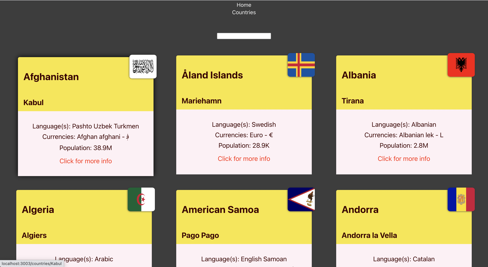
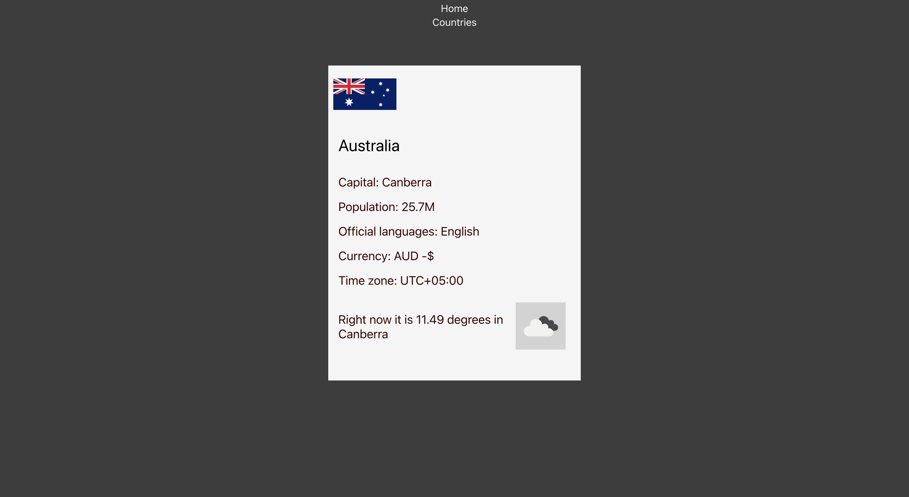

# Country App

## Description:

An application developed with React.js for the Full Stack Web Development program in Business College Helsinki.

An react application that retrieves info of different countries from API using axios.

Also uses another API to retrieve weather data of the countries.

## Application screenshots:

